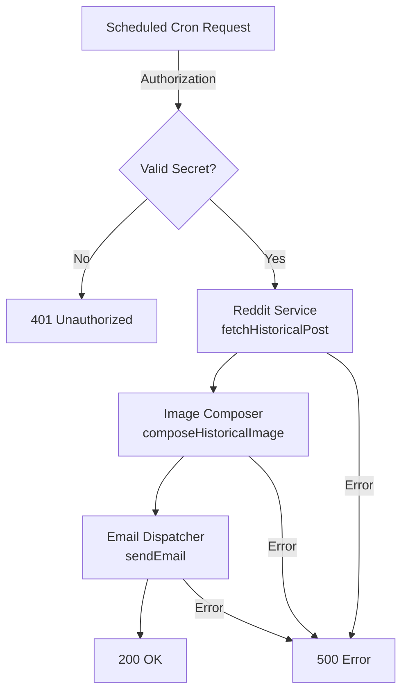

# Cron Pipeline Overview



## Flow Summary

1. **Authorization** — verifies the `CRON_SECRET` header before any work begins.
2. **Reddit service** — retrieves the best historical post for today using fuzzy date matching.
3. **Image composer** — resizes the image with letterboxing and applies a text overlay.
4. **Email dispatcher** — sends the composed image via Resend or Gmail depending on configuration.

## Key Modules

| Module                    | Responsibility                                      |
| ------------------------- | --------------------------------------------------- |
| `lib/config/cron.ts`      | Centralized environment validation for cron jobs    |
| `lib/logger.ts`           | Structured JSON logging helpers                     |
| `lib/reddit/service.ts`   | Reddit OAuth, post fetching, and fuzzy date scoring |
| `lib/image/composer.ts`   | Sharp-based image resizing and overlay composition  |
| `lib/email/dispatcher.ts` | Email delivery abstraction for Resend/Gmail         |
| `app/api/cron/route.ts`   | Orchestrates the full pipeline                      |

## Regenerating API Docs

```bash
pnpm run docs:cron
```

Typedoc output is written to `docs/cron/api`.
